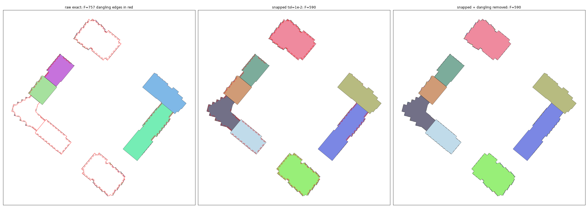

# `arrangement_2d` user guide

`arrangement_2d` is a Python binding of the [CGAL 6.1 *2D Arrangements*
package](https://doc.cgal.org/latest/Arrangement_on_surface_2/). It builds the exact
planar subdivision induced by a set of curves — segments, lines, circular arcs,
polylines, Bézier curves, conic arcs, or geodesic arcs on the sphere — and lets you
traverse it, edit it, query it, overlay it, and combine regions with Boolean set
operations. Every predicate is evaluated exactly; nothing depends on a tolerance unless
you explicitly ask for an approximation.

* [1. Installing and building](#1-installing-and-building)
* [2. Concepts](#2-concepts)
* [3. A first arrangement](#3-a-first-arrangement)
* [4. Coordinates: what goes in and what comes out](#4-coordinates-what-goes-in-and-what-comes-out)
* [5. The seven geometry kinds](#5-the-seven-geometry-kinds)
* [6. Traversing the arrangement](#6-traversing-the-arrangement)
* [7. Curve history](#7-curve-history)
* [8. Attaching your own data](#8-attaching-your-own-data)
* [9. Modifying an arrangement](#9-modifying-an-arrangement)
* [10. Queries: point location, ray shooting, zone, decomposition](#10-queries-point-location-ray-shooting-zone-decomposition)
* [11. Observers](#11-observers)
* [12. Overlay](#12-overlay)
* [13. Boolean set operations](#13-boolean-set-operations)
* [14. Region helpers](#14-region-helpers)
* [15. Plotting](#15-plotting)
* [16. The exactness model](#16-the-exactness-model)
* [17. The error model](#17-the-error-model)
* [18. Known CGAL 6.1 limitations](#18-known-cgal-61-limitations)
* [19. Where to go next](#19-where-to-go-next)

---

## 1. Installing and building

You need a C++17 compiler, the CGAL 6.1 headers, GMP, MPFR, the Boost headers,
Python ≥ 3.10 and Cython ≥ 3.

```console
$ brew install cgal gmp mpfr boost         # macOS; apt/conda equivalents work too
$ pip install -e .                         # or: python setup.py build_ext --inplace -j 8
```

A full build takes several minutes: each geometry kind is a separate, CGAL-heavy
translation unit, and they compile in parallel. `setup.py` finds CGAL, GMP and MPFR
through `CGAL_DIR` / `CGAL_INCLUDE_DIR` / `GMP_DIR` / …, then `CONDA_PREFIX`, then
`brew --prefix`, then `/usr/local` and `/usr`, then `pkg-config`.

Two dependencies are optional:

* **numpy** — the bulk export methods (`vertex_coordinates`, `edge_vertex_indices`,
  `face_boundaries`, `approximate_edges`) return arrays when it is importable and plain
  lists when it is not;
* **matplotlib** — needed only by `arrangement_2d.plot`.

Check what you actually built:

```python
>>> import arrangement_2d as a2
>>> a2.__version__, a2.cgal_version()
('0.1.0', '6.1')
>>> a2.build_info()
'CGAL 6.1; Exact_rational=...gmp_rational...; CORE; CGAL assertions on'
>>> a2.available_kinds()
(<Kind.SEGMENT: 0>, <Kind.LINEAR: 1>, <Kind.CIRCLE_SEGMENT: 2>, <Kind.POLYLINE: 3>, <Kind.BEZIER: 4>, <Kind.CONIC: 5>, <Kind.SPHERE: 6>)
```

---

## 2. Concepts

An **arrangement** of a set of curves is the subdivision of the plane (or of the sphere)
into **vertices**, **edges** and **faces** induced by those curves: every intersection
becomes a vertex, every maximal curve piece between two vertices becomes an edge, and
every connected region left over becomes a face.

It is stored as a **DCEL** (doubly-connected edge list). The pieces you touch from
Python are:

| object | what it is |
|---|---|
| `Vertex` | a point of the subdivision; knows its degree and its incident halfedges |
| `Halfedge` | one of the two opposite orientations of an edge; the face it bounds is always on its **left** |
| `Face` | a maximal connected region; bounded by CCBs and possibly containing isolated vertices |
| `CurveHandle` | one *input* curve, and the edges it induced |

A **CCB** (connected component of the boundary) is a closed cycle of halfedges. A face
has at most one **outer CCB** (traversed counterclockwise, the face on the left) and any
number of **inner CCBs**, also called **holes** (traversed clockwise from outside). A
face may also contain **isolated vertices** — points with no incident edge.

Every arrangement has exactly one **unbounded face** in the bounded planar kinds
(`arr.unbounded_face`); it has no outer CCB, only holes. The `linear` kind, which can
hold rays and lines, has *several* unbounded faces (`arr.unbounded_faces()`) plus an
internal **fictitious** face and fictitious halfedges that represent "the boundary at
infinity"; they are invisible to the normal iterators. On the sphere nothing is
unbounded, but there is still one distinguished face without an outer CCB — the
`spherical_face`, the one containing the north pole.

Every arrangement in `arrangement_2d` is an arrangement **with history**: it remembers
which input curve produced which edge, so you can ask an edge where it came from and
remove a whole input curve again.

Finally, an arrangement has a **kind** — one CGAL traits instantiation, fixed at
construction. Geometry of two different kinds never mixes silently; see
[section 5](#5-the-seven-geometry-kinds).

---

## 3. A first arrangement

```python
import arrangement_2d as a2

arr = a2.Arrangement("segment")
arr.insert([
    a2.Segment((0, 0), (4, 0)),
    a2.Segment((4, 0), (4, 4)),
    a2.Segment((4, 4), (0, 4)),
    a2.Segment((0, 4), (0, 0)),
    a2.Segment((-1, 2), (5, 2)),          # a chord that sticks out on both sides
])
```

```python
>>> arr
Arrangement(kind='segment', vertices=8, edges=9, faces=3, curves=5)
>>> arr.number_of_vertices, arr.number_of_edges, arr.number_of_faces
(8, 9, 3)
>>> arr.is_valid()
True
```

Eight vertices (four corners, two crossings with the chord, two loose chord ends), nine
edges (each vertical side is cut in two, the chord is cut in three), three faces (below
the chord, above it, and the unbounded one).

Locate a point and walk the boundary of the face it lands in:

```python
>>> face = arr.locate((2, 1))
>>> face
Face(id=20, unbounded=False, outer_ccbs=1, holes=0, isolated=0)
>>> [str(he.curve) for he in face.outer_ccb()]
['Segment((0, 2), (4, 2))', 'Segment((0, 2), (0, 0))', 'Segment((0, 0), (4, 0))', 'Segment((4, 0), (4, 2))']
```

---

## 4. Coordinates: what goes in and what comes out

Anywhere a coordinate is expected you may pass an `int`, a `float`, a
`fractions.Fraction`, a `decimal.Decimal` or a numeric string. All of them are converted
**exactly**: a `float` becomes the rational number it really is (`0.1` is
`3602879701896397/36028797018963968`, not `1/10`), which is why the following round-trip
looks the way it does:

```python
>>> from fractions import Fraction
>>> p = a2.Point(Fraction(1, 3), 0.1)
>>> p
Point(1/3, 3602879701896397/36028797018963968)
>>> p.exact()
(Fraction(1, 3), Fraction(3602879701896397, 36028797018963968))
>>> p.approx
(0.3333333333333333, 0.1)
```

If you mean one tenth, say `Fraction(1, 10)`, `"0.1"` or `Decimal("0.1")`.

Anywhere a *point* is expected you may also pass a plain tuple: `arr.locate((2, 1))`,
`a2.Segment((0, 0), (4, 4))`, `ps.oriented_side((1, 1))`. Three-element tuples are
sphere directions.

Every point and curve offers three views of its coordinates:

* `.approx` — plain `float`s, always available, correctly rounded;
* `.exact()` — `Fraction`, `SqrtExtension` or `Algebraic` per coordinate, depending on
  what the kind can produce;
* `.interval(bits)` — a certified enclosure `(lo, hi)` per coordinate.

See [section 16](#16-the-exactness-model) for the details.

---

## 5. The seven geometry kinds

A kind is one CGAL traits instantiation. An `Arrangement`, a `PolygonSet`, a `Point` and
a `Curve` each carry one, and mixing them raises `KindMismatchError` unless an exact
conversion exists (`.to_kind(...)` performs one on request).

| kind | curves | topology | Boolean ops | coordinates |
|---|---|---|---|---|
| `segment` | line segments | bounded plane | yes | rational |
| `linear` | segments, rays, lines | unbounded plane | – | rational |
| `circle_segment` | circular arcs, full circles, segments | bounded plane | yes | `a + b·√c` |
| `polyline` | polylines of segments | bounded plane | – | rational |
| `bezier` | polynomial Bézier curves, any degree | bounded plane | yes | algebraic |
| `conic` | ellipse / parabola / hyperbola / segment arcs | bounded plane | yes | algebraic |
| `sphere` | geodesic arcs on the unit sphere | sphere | – | rational directions |

Every kind name is accepted wherever a kind is: `"segment"`, `a2.Kind.SEGMENT`, `0`, and
a few aliases (`"seg"`, `"lines"`, `"circle"`, `"arc"`, `"geodesic"`, …). So is any
object with a `.kind`.

### 5.1 `segment` — line segments

The default and the fastest kind. Coordinates are rational, predicates are exact
(`Epeck`).

```python
>>> seg = a2.Arrangement("segment")
>>> _ = seg.insert([a2.Segment((0, 0), (4, 4)), a2.Segment((0, 4), (4, 0))])
>>> seg
Arrangement(kind='segment', vertices=5, edges=4, faces=1, curves=2)
>>> seg.vertices()[1].point                     # the crossing, computed exactly
Point(2, 2)
```

### 5.2 `linear` — segments, rays and lines

The only kind with an unbounded topology: it can hold lines and rays, and it has several
unbounded faces plus a fictitious face and fictitious halfedges at infinity.

```python
>>> lin = a2.Arrangement("linear")
>>> _ = lin.insert([a2.Line((0, 0), (1, 0)), a2.Line((0, 0), (0, 1)), a2.Ray((0, 0), (1, 1))])
>>> lin
Arrangement(kind='linear', vertices=1, edges=5, faces=5, curves=3)
>>> lin.number_of_unbounded_faces, lin.number_of_vertices_at_infinity
(5, 5)
>>> lin.fictitious_face
Face(id=14, unbounded=True, outer_ccbs=0, holes=1, isolated=0)
```

Constructors: `a2.Line(p, q)`, `a2.Ray(source, towards)`,
`a2.LinearCurve.segment(p, q)`, `a2.line_from_coefficients(a, b, c)` for `ax + by + c = 0`.

Two things behave differently here:

* `arr.unbounded_face` returns *one* of the unbounded faces, and which one drifts —
  always use `arr.unbounded_faces()`;
* an unbounded edge exists, so `Face.polygon()` is not available for those faces, and
  drawing or approximating them needs a clipping box.

### 5.3 `circle_segment` — circular arcs and segments

Circles with a rational centre and a rational squared radius, their arcs, and straight
segments. Intersection points have coordinates of the form `a + b·√c` with rational
`a`, `b`, `c`, exposed as `SqrtExtension`.

```python
>>> cs = a2.Arrangement("circle_segment")
>>> _ = cs.insert([a2.Circle((0, 0), 2), a2.Circle((2, 0), 2)])
>>> cs
Arrangement(kind='circle_segment', vertices=6, edges=8, faces=4, curves=2)
>>> crossing = [v for v in cs.vertices() if not v.point.is_rational][0]
>>> crossing.point
(1, 0 - 1/4*sqrt(48))
>>> crossing.point.exact()
(Fraction(1, 1), SqrtExtension(0, -1/4, 48))
>>> crossing.point.approx
(1.0, -1.7320508075688772)
```

Constructors: `a2.Circle(center, radius)` (or `squared_radius=`),
`a2.CircularArc(center, radius, source=..., target=..., orientation="ccw")`,
`a2.CircleSegment.arc_from_three_points(p, q, r)`, `a2.CircleSegment.segment(p, q)`.
Prefer the radius constructor: it guarantees the rational tangency points CGAL wants.

### 5.4 `polyline` — chains of segments

One input curve is a whole chain, which keeps the number of history entries small.

```python
>>> pl = a2.Arrangement("polyline")
>>> _ = pl.insert([a2.Polyline([(0, 0), (2, 2), (4, 0)]), a2.Polyline([(0, 1), (4, 1)])])
>>> pl
Arrangement(kind='polyline', vertices=6, edges=6, faces=2, curves=2)
```

`Polyline` supports `len()`, indexing, `.points` and `.segments`.

### 5.5 `bezier` — polynomial Bézier curves

Rational control points, any degree. Coordinates of intersection points are algebraic
numbers (`Algebraic`: a `float` approximation plus a certified interval that you can
refine).

```python
>>> bz = a2.Arrangement("bezier")
>>> _ = bz.insert([a2.BezierCurve([(0, 0), (1, 3), (2, 0)]), a2.BezierCurve([(0, 1), (2, 1)])])
>>> bz
Arrangement(kind='bezier', vertices=6, edges=6, faces=2, curves=2)
>>> c = a2.BezierCurve([(0, 0), (1, 3), (2, 0)])
>>> c.degree, c.control_points
(2, [Point(0, 0), Point(1, 3), Point(2, 0)])
>>> c.evaluate(Fraction(1, 2))                  # exact for a rational parameter
BezierPoint(1, 1.5)
```

*Rational* Bézier curves are not polynomial. A rational **quadratic** Bézier curve is
exactly a conic arc and is supported exactly through the `conic` kind
(`a2.ConicArc.from_rational_bezier(p0, p1, p2, w0, w1, w2)`, also reachable as
`a2.BezierCurve.from_rational(points, weights)` for degree 2). Higher-degree rational
Bézier curves cannot be represented exactly by any of CGAL 6.1's traits and must be
approximated.

This kind has real CGAL 6.1 restrictions — see [section 18](#18-known-cgal-61-limitations).

### 5.6 `conic` — conic arcs

Ellipses, parabolas, hyperbolas, circles and segments, given by the coefficients of
`r·x² + s·y² + t·x·y + u·x + v·y + w = 0` plus an orientation and two endpoints.

```python
>>> cn = a2.Arrangement("conic")
>>> ellipse = a2.ConicArc.ellipse((0, 0), 3, 2)
>>> ellipse.conic_type
'ellipse'
>>> ellipse.coefficients
(Fraction(-4, 1), Fraction(-9, 1), Fraction(0, 1), Fraction(0, 1), Fraction(0, 1), Fraction(36, 1))
>>> _ = cn.insert([ellipse, a2.ConicArc.segment((-3, 0), (3, 0))])
>>> cn
Arrangement(kind='conic', vertices=2, edges=3, faces=3, curves=2)
```

Constructors: `from_coefficients`, `circle`, `ellipse`, `segment`, `from_points(p1..p5)`,
`from_rational_bezier`, `from_circle_segment`.

### 5.7 `sphere` — geodesic arcs on the unit sphere

Points are **directions** `(x, y, z)` with rational components; they are not normalised,
and two directions are equal when they are positive multiples of each other. Curves are
arcs of great circles.

```python
>>> sp = a2.Arrangement("sphere")
>>> _ = sp.insert([a2.GeodesicArc.from_points((3, 1, 1), (1, 3, 1)),
...                a2.GeodesicArc.from_points((1, 3, 1), (1, 1, 3)),
...                a2.GeodesicArc.from_points((1, 1, 3), (3, 1, 1))])
>>> sp
Arrangement(kind='sphere', vertices=3, edges=3, faces=2, curves=3)
>>> sp.spherical_face                            # the face containing the north pole
Face(id=1, unbounded=False, outer_ccbs=0, holes=1, isolated=0)
>>> sp.locate((1, 1, 1))                         # inside the triangle
Face(id=11, unbounded=False, outer_ccbs=1, holes=0, isolated=0)
```

The sphere is parametrised with an **identification curve** (the −x meridian) and two
poles; several operations are restricted around them, see
[section 18](#18-known-cgal-61-limitations).

---

## 6. Traversing the arrangement

Every iteration method returns a **list snapshot**, so you may modify the arrangement
while walking your own copy (the handles you hold are checked on every access, and a
handle whose element has been deleted raises `InvalidHandleError` instead of crashing).

```text
arr.vertices()          # concrete vertices (never the ones at infinity)
arr.halfedges()         # both halfedges of every edge
arr.edges()             # one halfedge per edge
arr.faces()             # every face except the fictitious one
arr.unbounded_faces()   # the unbounded ones
arr.bounded_faces()     # the rest
arr.curves()            # the input curves (history)
```

From a handle:

```text
v.point, v.degree, v.is_isolated, v.incident_halfedges(), v.incident_faces(), v.face
he.source, he.target, he.twin, he.next, he.prev, he.face, he.curve, he.directed_curve
he.direction, he.is_fictitious, he.is_on_inner_ccb, he.ccb(), he.edge_id
f.is_unbounded, f.has_outer_ccb, f.outer_ccb(), f.outer_ccbs(), f.inner_ccbs(), f.holes()
f.isolated_vertices(), f.edges(), f.adjacent_faces(), f.polygon(), f.boundary_points(tol)
```

`he.curve` is the curve as stored (its own direction); `he.directed_curve` is the same
curve oriented from `he.source` to `he.target`. A face's outer CCB always runs
counterclockwise and its holes clockwise, so "the face is on the left of every halfedge"
holds everywhere.

`Face.polygon()` gives the exact boundary as a `PolygonWithHoles`;
`Face.boundary_points(tolerance)` gives a polyline approximation of it, which is what you
want for drawing or for exporting to a format that only knows polygons.

For bulk work there are vectorised exports (numpy arrays when numpy is available):

```text
arr.vertex_coordinates()        # (n, 2) or (n, 3) floats, in vertices() order
arr.edge_vertex_indices()       # (m, 2) ints into that array, -1 for a vertex at infinity
arr.face_boundaries()           # per face, per CCB, the vertex indices
arr.approximate_edges(1e-3)     # per edge, a polyline
arr.bbox()                      # (xmin, ymin, xmax, ymax)
```

---

## 7. Curve history

Insertion returns handles on the *input* curves, and the arrangement keeps them:

```python
>>> h = a2.Arrangement("segment")
>>> handles = h.insert([a2.Segment((0, 0), (4, 4)), a2.Segment((0, 4), (4, 0))])
>>> handles
[CurveHandle(id=15, curve=Segment((0, 0), (4, 4)), induced_edges=2), CurveHandle(id=16, curve=Segment((0, 4), (4, 0)), induced_edges=2)]
>>> [len(ch.induced_edges()) for ch in handles]     # each was cut in two by the other
[2, 2]
>>> [str(c.curve) for c in h.edges()[0].originating_curves()]
['Segment((0, 0), (4, 4))']
```

`remove_curve` deletes every edge that *only* this curve induced; an edge that another
curve also induced survives and simply loses one originating curve:

```python
>>> h.remove_curve(handles[0])           # number of removed edges
2
>>> h
Arrangement(kind='segment', vertices=3, edges=2, faces=1, curves=1)
```

The history node itself stays (with zero induced edges), which is CGAL's behaviour, so
`number_of_curves` does not drop.

Only the *history-aware* insertions record curves: `insert`, `insert_curves`. The
`insert_non_intersecting*` family and the topological `insert_in_face_interior` /
`insert_from_left_vertex` / … family do not.

---

## 8. Attaching your own data

Every vertex, halfedge and face has a `.data` slot that holds an arbitrary Python
object:

```python
>>> room = a2.Arrangement("segment")
>>> _ = room.insert([a2.Segment((0, 0), (4, 0)), a2.Segment((4, 0), (4, 4)),
...                  a2.Segment((4, 4), (0, 4)), a2.Segment((0, 4), (0, 0))])
>>> face = room.bounded_faces()[0]
>>> face.data = {"name": "kitchen", "area": 16}
>>> room.copy().bounded_faces()[0].data           # copies carry the data along
{'name': 'kitchen', 'area': 16}
```

The data survives `copy()`, `assign()` and (if you ask for it) an overlay. It is stored
so that reference cycles through it are still collectable — `face.data = {"arr": arr}`
does *not* leak the arrangement.

---

## 9. Modifying an arrangement

### Insertion

| method | what it does | history |
|---|---|---|
| `insert(x)` | a point → a vertex, a curve → one `CurveHandle`, an iterable → one sweep | yes |
| `insert_curves(curves)` | aggregate (sweep-line) insertion | yes |
| `insert_point(p)` | an isolated vertex (splits an edge if it lands on one) | no |
| `insert_non_intersecting(xcurve)` | the curve may not meet anything | no |
| `insert_in_face_interior(xcurve, face)` | both ends strictly inside `face` | no |
| `insert_from_left_vertex(xcurve, v)` | the curve's left end is `v` | no |
| `insert_from_right_vertex(xcurve, v)` | the curve's right end is `v` | no |
| `insert_at_vertices(xcurve, v1, v2)` | both ends already exist | no |

Inserting many curves in **one** `insert(...)` call runs CGAL's sweep once and is much
faster than a loop of single insertions, besides being the only safe way to insert a set
of curves on the sphere that touches the identification meridian.

The `insert_*` methods below `insert_curves` in the table trade safety for speed: their
preconditions are yours to satisfy, and violating one raises `PreconditionError` (or, in
the one case where CGAL 6.1 does not check, leaves an arrangement whose `is_valid()` is
`False`).

### Modification and removal

```text
arr.modify_vertex(v, point)        arr.modify_edge(he, xcurve)
arr.split_edge(he, point)          arr.split_edge(he, c1, c2)
arr.merge_edge(he1, he2)           arr.merge_edge(he1, he2, xcurve)
arr.remove_edge(he, remove_source=True, remove_target=True)   # -> the merged face
arr.remove_vertex(v)               # isolated, or degree 2 with mergeable curves -> bool
arr.remove_isolated_vertex(v)      # -> the face that contained it
arr.remove_curve(curve_handle)     # -> number of removed edges
arr.clear()                        arr.copy()      arr.assign(other)
```

`split_edge` and `merge_edge` keep the history consistent. `split_edge(he, point)`
verifies that the point really lies in the interior of the edge before calling CGAL —
several traits do not check it themselves and would silently corrupt the arrangement.

---

## 10. Queries: point location, ray shooting, zone, decomposition

### Point location

```python
>>> arr.locate((2, 1))
Face(id=20, unbounded=False, outer_ccbs=1, holes=0, isolated=0)
>>> arr.locate((0, 0))                    # exactly on a vertex
Vertex(id=2, point=Point(0, 0), degree=2)
>>> arr.locate((2, 0))                    # exactly on an edge
Halfedge(id=14, curve=Segment((0, 0), (4, 0)), direction='right_to_left')
```

The result is a `Vertex`, a `Halfedge` or a `Face`; a halfedge result may be either of
the two twins, so compare with `he.edge_id`, not with `he`.

Six strategies exist; which of them are usable depends on the kind *and* on the current
content of the arrangement:

```python
>>> a2.point_location_strategies()
('naive', 'simple', 'walk', 'landmarks', 'trapezoid', 'triangulation')
>>> [s for s in a2.point_location_strategies() if arr.supports_point_location(s)]
['naive', 'simple', 'walk', 'landmarks', 'trapezoid']
```

With no strategy attached, `locate` walks along a line. For many queries on a stable
arrangement, attach one — it is then built once and kept up to date:

```python
arr.attach_point_location("trapezoid")
face = arr.locate((2, 1))                 # every locate() now uses the structure
arr.detach_point_location("trapezoid")
```

`ray_shoot_up` / `ray_shoot_down` shoot a vertical ray and return the first feature hit
(only `simple`, `walk` and `trapezoid` can do it). `batched_locate(points)` answers many
queries with a single sweep and returns the answers **in the input order**:

```python
>>> arr.batched_locate([(2, 1), (2, 3), (9, 9)])
[Face(id=20, ...), Face(id=26, ...), Face(id=1, unbounded=True, ...)]
```

### Zone and `do_intersect`

`arr.zone(curve)` returns the features the curve would pass through, in order, **without
inserting it**; `arr.do_intersect(curve)` only says whether it meets anything.

```python
>>> arr.zone(a2.Segment((-2, 1), (6, 1)))
[Face(id=1, ...), Halfedge(...Segment((0, 2), (0, 0))...), Face(id=20, ...), Halfedge(...Segment((4, 0), (4, 2))...), Face(id=1, ...)]
```

### Vertical decomposition

`arr.decompose()` returns, for every vertex in xy-lexicographic order, what a vertical
ray hits below and above it:

```python
>>> arr.decompose()[1]
(Vertex(id=2, point=Point(0, 0), degree=2), Face(id=1, unbounded=True, ...), None)
```

In an unbounded arrangement, "nothing above/below" is reported as a **fictitious
halfedge** rather than as `None`; test `he.is_fictitious`.

---

## 11. Observers

An observer is notified of every DCEL change. Subclass `a2.Observer`, override the
notifications you care about — the ones you do not override are never even dispatched —
and attach the instance:

```python
class Log(a2.Observer):
    def __init__(self):
        self.events = []

    def after_create_vertex(self, v):
        self.events.append(("vertex", v.point.xy))

    def after_split_face(self, f, new_f, is_hole):
        self.events.append(("split_face", is_hole))


watched = a2.Arrangement("segment")
log = watched.add_observer(Log())
watched.insert([a2.Segment((0, 0), (2, 0)), a2.Segment((2, 0), (2, 2)),
                a2.Segment((2, 2), (0, 2)), a2.Segment((0, 2), (0, 0))])
assert log.events[-1] == ("split_face", True)     # the square carved a hole out
watched.remove_observer(log)
```

The full list of notifications (`before_*` / `after_*` for create, modify, split, merge,
move and remove of vertices, edges, faces and CCBs, plus `before/after_global_change`,
`before/after_clear`, `before/after_assign`, `before/after_attach`,
`before/after_detach`) is in the
[API reference](api_reference.md#observer).

Three rules, all enforced:

* **an observer may not modify its arrangement.** CGAL is in the middle of a DCEL
  surgery when it calls you; a re-entrant `insert()`, `clear()` or `remove_curve()`
  would crash. Any mutator called from inside a notification raises instead.
* **some handles are incomplete during some events.** A vertex handed to
  `after_create_vertex`, `after_create_boundary_vertex`, `before_create_edge` or
  `before_split_edge` has no incident halfedge yet, and inside `before_remove_vertex`
  the ring around a non-isolated vertex is already gone: `degree()`,
  `incident_halfedges()` and `incident_faces()` are refused there. Inside
  `before_split_face(f, e)`, `e.face` and `e.twin.face` are refused.
* **exceptions from a callback do not escape into CGAL.** They are recorded and
  re-raised after the operation.

An aggregate insertion brackets the whole batch with one
`before_global_change`/`after_global_change` pair.

---

## 12. Overlay

`a.overlay(b)` builds a new arrangement containing every vertex, edge and face induced by
both inputs. Callbacks let you compute the data of each result feature from the two
features it came from:

```python
>>> a = a2.Arrangement("segment")
>>> _ = a.insert([a2.Segment((0, 0), (4, 0)), a2.Segment((4, 0), (4, 4)),
...               a2.Segment((4, 4), (0, 4)), a2.Segment((0, 4), (0, 0))])
>>> b = a2.Arrangement("segment")
>>> _ = b.insert([a2.Segment((2, 2), (6, 2)), a2.Segment((6, 2), (6, 6)),
...               a2.Segment((6, 6), (2, 6)), a2.Segment((2, 6), (2, 2))])
>>> a.bounded_faces()[0].data = "A"
>>> b.bounded_faces()[0].data = "B"
>>> r = a.overlay(b, on_face=lambda fa, fb: (fa.data, fb.data))
>>> r
Arrangement(kind='segment', vertices=10, edges=12, faces=4, curves=8)
>>> sorted(str(f.data) for f in r.faces())
["('A', 'B')", "('A', None)", "(None, 'B')", '(None, None)']
```

`on_vertex`, `on_edge` and `on_face` are the shorthand form. For full control pass an
`a2.OverlayCallbacks` subclass (or a dict of callables) with the ten methods of CGAL's
`OverlayTraits` concept: `vertex_vertex`, `vertex_edge`, `vertex_face`, `edge_vertex`,
`face_vertex`, `edge_edge_vertex`, `edge_edge`, `edge_face`, `face_edge`, `face_face`.
Each receives the feature of `a`, the feature of `b` and the freshly created feature of
the result.

The inputs are not modified. The result's history contains *copies* of all input curves
of both arrangements, so an input `CurveHandle` does not identify an output curve.

---

## 13. Boolean set operations

Four kinds have 2D Boolean set operations: `segment`, `circle_segment`, `conic` and
`bezier` (ask `a2.regions.supports_boolean_ops(kind)`). A `PolygonSet` is a point set
bounded by curves of one kind, closed under union, intersection, difference, symmetric
difference and complement.

```python
>>> ps = a2.PolygonSet("segment")
>>> ps.insert(a2.Polygon([(0, 0), (4, 0), (4, 4), (0, 4)]))
>>> other = a2.PolygonSet("segment")
>>> other.insert(a2.Polygon([(2, 2), (6, 2), (6, 6), (2, 6)]))
>>> (ps | other).number_of_polygons_with_holes
1
>>> (ps & other).polygons_with_holes()[0].outer.points
[Point(2, 2), Point(4, 2), Point(4, 4), Point(2, 4)]
>>> ps.oriented_side((1, 1))          # +1 inside, 0 on the boundary, -1 outside
1
```

The operators `|`, `&`, `-`, `^` and `~` return new sets; the methods `join`,
`intersection`, `difference`, `symmetric_difference` and `complement` work in place and
return `self`. The free functions `a2.join(a, b)`, `a2.intersection(a, b)`, … accept
polygons directly and never modify their arguments.

Other members: `polygons_with_holes()`, `locate(point)`, `do_intersect(other)`,
`is_valid()`, `copy()`, `is_empty`, `is_plane`, and `to_arrangement()`, which returns
`(arrangement, contained_faces)` — a real arrangement of all boundary curves plus the
faces that belong to the set.

CGAL requires counterclockwise outer boundaries and clockwise holes; `insert` fixes the
orientation for you by default (`fix_orientation=False` turns that off). Use `join`
rather than `insert` when the new polygons may overlap what is already in the set —
`insert` assumes they are disjoint from it.

---

## 14. Region helpers

`arrangement_2d.regions` is a pure-Python layer for the operations one usually wants on
whole regions rather than on single DCEL elements. It is imported lazily, so
`a2.regions.…` just works.

```text
from arrangement_2d import regions

regions.bounded_faces(arr)                  # the faces of finite area
regions.face_containing(arr, (2, 1))        # locate, but always a Face or None
regions.face_area(face)                     # Fraction for rational kinds, float otherwise
regions.faces_polygons(arr, 1e-2)           # [FaceBoundary(face, outer, holes), ...]
regions.shared_edges(faces)                 # the edges between the faces of a group
regions.merge_faces(arr, faces)             # remove those edges -> the merged faces
regions.split_face(arr, face, curve)        # cut one face -> its pieces
regions.connected_components(arr)           # [Component(vertices, edges), ...]
regions.number_of_connected_components(arr)
regions.extract_regions(arr, predicate)     # select faces, group the adjacent ones
regions.union_outline(arr)                  # the covered area as a PolygonSet
regions.supports_boolean_ops(kind)
```

A worked example — take the square with a chord from
[section 3](#3-a-first-arrangement), measure its two rooms, take the outline of
everything, then merge the rooms back into one:

```python
>>> from arrangement_2d import regions
>>> rr = a2.Arrangement("segment")
>>> _ = rr.insert([a2.Segment((0, 0), (4, 0)), a2.Segment((4, 0), (4, 4)),
...                a2.Segment((4, 4), (0, 4)), a2.Segment((0, 4), (0, 0)),
...                a2.Segment((0, 2), (4, 2))])
>>> [regions.face_area(f) for f in regions.bounded_faces(rr)]
[Fraction(8, 1), Fraction(8, 1)]
>>> regions.union_outline(rr).polygons_with_holes()
[<PolygonWithHoles kind='segment' outer=(6 curves) holes=0>]
>>> merged = regions.merge_faces(rr, regions.bounded_faces(rr))
>>> merged, regions.face_area(merged[0])
([Face(id=17, unbounded=False, outer_ccbs=1, holes=0, isolated=0)], Fraction(16, 1))
>>> rr
Arrangement(kind='segment', vertices=4, edges=4, faces=2, curves=5)
```

`merge_faces` removes every edge whose two sides are two different faces of the group
(including a second edge between the same pair, which would otherwise be left dangling
in the interior), then drops the vertices that became isolated or redundant. Faces of
the group that are not adjacent stay separate, which is why the return value is a list.

`extract_regions` is the natural partner: it selects faces with a predicate — typically
one that reads `Face.data` — and groups the adjacent ones, so
`[merge_faces(arr, g) for g in extract_regions(arr, pred)]` merges each region on its
own.

`split_face` verifies with `zone` that the curve really stays inside the face
*before* inserting anything, so a curve that would leave the face is rejected with the
arrangement untouched.

`union_outline` uses the exact boundaries (`Face.polygon()`), so it is exact; it needs a
kind with Boolean set operations.

---

## 14b. Cleaning up messy input (`arrangement_2d.cleanup`)

The arrangement is exact, and that cuts both ways. CGAL computes every intersection,
splits every curve at every intersection point, merges exactly overlapping pieces into one
edge (recording all the input curves that induced it) and handles T-junctions and shared
endpoints perfectly — *when they are exact*. Two endpoints that differ by 1e-9 are two
different points; an endpoint that misses another segment by 1e-9 is a gap, not a
T-junction. Data coming from CAD exports, GIS layers or floating-point computations is full
of such near misses, and every one of them opens a face: the intended region leaks into
its neighbour or into the unbounded face, and "the big faces are never found".

`arrangement_2d.cleanup` closes those gaps *before* the exact arrangement is built:

```python
from arrangement_2d import cleanup, regions

segs = [((x1, y1), (x2, y2)), ...]            # or cleanup.segments_from_polylines(polylines)

print(cleanup.near_miss_report(segs))          # how many endpoint / T-junction gaps at each tolerance
arr = cleanup.clean_arrangement(segs, tolerance=1e-2)     # snap, build exactly, drop dangling edges
for face in regions.bounded_faces(arr):
    print(regions.face_area(face))
```

* `near_miss_report(segs)` tells you, for several tolerances, how many endpoints almost
  touch another endpoint and how many almost touch the interior of another segment. Pick a
  tolerance above the noise and below the real geometry.
* `snap_segments(segs, tolerance)` merges endpoint clusters closer than the tolerance,
  snaps endpoints onto nearby segments (splitting them there, so near T-junctions become
  exact ones), drops zero-length and duplicate segments, and iterates until nothing moves.
  Collinear near-overlaps become exact overlaps, which the arrangement then merges into a
  single edge by itself.
* `remove_dangling_edges(arr)` removes every edge that has the same face on both sides
  (antennas, isolated pieces), repeatedly, so that every remaining edge separates two
  faces.
* `clean_arrangement(segs, tolerance)` is the three steps in one call.

On a real 4965-segment CAD drawing (`tst.json` in the repository) the exact arrangement
finds 4 of the 10 building outlines; after `clean_arrangement(..., tolerance=1e-2)` all
10 are closed faces and the bounded area more than doubles:



CGAL itself offers only grid *snap rounding* (`Snap_rounding_2`, which moves every vertex
to a pixel grid and closes gaps smaller than a pixel as a side effect) and polygon repair
for closed polygons, neither of which is a substitute for tolerance-based snapping of a
segment soup.

## 15. Plotting

`arrangement_2d.plot` is a thin matplotlib layer. matplotlib is imported inside the
functions, so importing the module without it installed is fine — only calling a
function then raises `ImportError`.

```python
import matplotlib.pyplot as plt
import arrangement_2d as a2

ring = a2.Arrangement("circle_segment")
ring.insert([a2.Circle((0, 0), 4), a2.Circle((0, 0), 2)])

ax = a2.plot.plot_arrangement(ring, tolerance=1e-2, face_colors="index")
plt.show()
```

`plot_arrangement(arr, ax=None, ...)` fills the faces, draws the edges and marks the
vertices. The interesting parameters:

* `tolerance` — how closely curved edges are followed;
* `bbox=(xmin, ymin, xmax, ymax)` — clips the unbounded edges of the `linear` kind (a
  padded box around the arrangement is used when you omit it) and sets the view;
* `face_colors` — `None` (no fill), `"index"` (the axes' colour cycle),
  `"data"` (one colour per distinct `Face.data` value), a single colour, a callable
  `face -> colour`, a mapping keyed by `Face` / `face.id` / `face.data`, or a sequence;
* `faces` — which faces to fill (bounded ones by default);
* `show_vertices`, `show_edges`, `projection`, `aspect`, `autoscale`.

Faces with holes are drawn as one compound path with the holes punched out. The `sphere`
kind is projected to longitude/latitude (`a2.plot.lonlat`, or your own `projection`
callable) and its faces are not filled.

`plot_polygon_set(polygons, ax=None, ...)` draws a `PolygonSet`, a `PolygonWithHoles`, a
`Polygon` or an iterable of those; an unbounded polygon-with-holes (the result of a
complement) is drawn as the clip rectangle with its holes punched out.
`plot_curves(curves, ax=None, ...)` draws a bare list of curves without building an
arrangement.

---

## 16. The exactness model

Every *decision* — does this curve cross that one, is this point left of that one, which
face contains this point — is made exactly, with rational or algebraic arithmetic. No
tolerance, no epsilon, no "almost degenerate" case that goes the wrong way.

What that costs you is that some coordinates are not rational numbers, and that
converting them to `float` is a lossy, deliberate step:

| kind | coordinate type | `exact()` returns |
|---|---|---|
| `segment`, `linear`, `polyline` | rational | `Fraction` |
| `circle_segment` | `a + b·√c` | `SqrtExtension(a, b, c)` (a `Fraction` when `b == 0`) |
| `bezier`, `conic` | real algebraic | `Algebraic` |
| `sphere` | rational direction | `Fraction` per component |

* `.approx` is always available and is **correctly rounded** — the nearest `double`, not
  merely a close one. (CGAL's own `to_double` is not; this binding never uses it for
  user-visible numbers.)
* `.interval(bits)` returns a *certified* enclosure: the true value is guaranteed to lie
  inside it.
* `Algebraic` carries a `float` approximation plus such an interval, and
  `.refine(bits)` tightens it on demand; `.is_rational` and `.exact()` tell you whether
  it happens to be a rational number.
* `SqrtExtension(a, b, c)` is `a + b·√c` with all three rational; it is normalised, so
  `is_rational` is correct even when `c` is a perfect square.

Comparisons between exact numbers are exact too, including across representations
(`Algebraic` against `Fraction`, `SqrtExtension` against `Algebraic`, …).

Approximation is always explicit and always takes a tolerance:

```text
curve.approximate(tolerance=1e-3, bbox=None)   # -> [(x, y), ...]
face.boundary_points(tolerance)                # -> (outer, [holes])
arr.approximate_edges(tolerance, bbox)         # -> one polyline per edge
polygon.approximate(tolerance)                 # -> [(x, y), ...]
```

The tolerance is an absolute deviation in coordinate units and must be positive. The
`segment`, `linear` and `polyline` kinds ignore it (their edges are already straight);
on the sphere it must not exceed 2.

---

## 17. The error model

| exception | base classes | when |
|---|---|---|
| `CGALError` | `Exception` | base of everything CGAL threw |
| `PreconditionError` | `CGALError`, `ValueError` | you called something with geometrically illegal arguments |
| `PostconditionError` | `CGALError` | CGAL's own postcondition failed (a bug) |
| `CGALAssertionError` | `CGALError`, `AssertionError` | a CGAL internal assertion |
| `CGALWarning` | `CGALError`, `UserWarning` | a CGAL warning, raised rather than printed |
| `InvalidHandleError` | `ValueError` | a `Vertex`/`Halfedge`/`Face`/`CurveHandle` whose element is gone, or one from another arrangement |
| `KindMismatchError` | `TypeError` | geometry of two kinds was mixed |
| `NotXMonotoneError` | `ValueError` | an x-monotone curve was required |
| `NotRepresentableError` | `ValueError` | an exact conversion between kinds does not exist |
| `UnsupportedError` | `NotImplementedError` | the operation is not available for this kind / this arrangement |
| `CallbackError` | `RuntimeError` | your observer or overlay callback raised |

```python
>>> arr.modify_edge(arr.edges()[0], a2.Segment((0, 0), (9, 9)))
Traceback (most recent call last):
    ...
arrangement_2d.errors.PreconditionError: CGAL precondition violation: ...The new curve is different from the current one.

>>> a2.Arrangement("segment").insert(a2.GeodesicArc.from_points((1, 0, 0), (0, 1, 0)))
Traceback (most recent call last):
    ...
arrangement_2d.errors.NotRepresentableError: segment: a geodesic arc on the sphere is not a planar straight segment

>>> stale = arr.vertices()[0]
>>> arr.clear()
>>> stale.point
Traceback (most recent call last):
    ...
arrangement_2d.errors.InvalidHandleError: vertex handle is not valid: the element was deleted or belongs to another arrangement
```

Three properties worth knowing:

* CGAL's checks are **compiled in** (`-DNDEBUG -DCGAL_DEBUG`): a precondition violation
  raises instead of being undefined behaviour. The C `assert()`s are off, so the cost is
  only CGAL's own predicates.
* CGAL's default handler prints the whole violation block to `stderr` before throwing;
  this binding installs silent handlers, so you get the exception and nothing else.
* A `PreconditionError` that escapes a **sweep** (an aggregate insertion, an overlay, a
  decomposition, a batched location, a Boolean operation) may leave the arrangement in an
  invalid state. Check `arr.is_valid()` after catching one. Single insertions and the
  local modification functions leave the arrangement untouched.

---

## 18. Known CGAL 6.1 limitations

These are CGAL 6.1 defects and design restrictions that survive into this binding. Each
one is either repaired, refused with a clear `UnsupportedError`, or documented here. The
full technical record — with the CGAL file and line of every one — is in
`docs/dev/CGAL_TRAPS_CHECKLIST.md`.

### Everywhere

* **Point location strategies are not universal.** `triangulation` is never offered (it
  silently returns the wrong face for faces with holes). `landmarks` is unavailable for
  `circle_segment` and `bezier` (their traits cannot build a curve through two given
  points) and for `sphere`, and on `linear` it is offered only while the arrangement
  contains no ray and no line — inserting one turns it off, removing it turns it back
  on. `trapezoid` is unavailable for `linear` and `sphere`; on the sphere only `naive`
  is left. Ray shooting only works with `simple`, `walk` and `trapezoid`. Always ask
  `arr.supports_point_location(name)`:

  | kind | usable strategies |
  |---|---|
  | `segment`, `polyline`, `conic` | naive, simple, walk, landmarks, trapezoid |
  | `linear` | naive, simple, walk, landmarks (while no ray/line is present) |
  | `circle_segment`, `bezier` | naive, simple, walk, trapezoid |
  | `sphere` | naive |
* **An attached `trapezoid` structure makes edge merges expensive.** CGAL asserts on
  every merge, so `merge_edge` and `remove_vertex` detach and rebuild it — O(size) per
  merge. Detach it first if you are about to merge many edges.
* **Nothing may modify the arrangement from inside an observer or an overlay callback**
  (see [section 11](#11-observers)).
* **`unbounded_face` is not unique in the `linear` kind** and the one it returns drifts;
  use `unbounded_faces()`.
* **Approximation needs a positive tolerance.** A non-positive one is refused (CGAL
  hangs or crashes on it); on the sphere it must be ≤ 2.

### `linear`

Inserting a line or a ray whose overlap with an existing edge is itself unbounded aborts
inside CGAL, and is refused with `UnsupportedError`. The arrangement is left untouched.

### `sphere`

* Only the `naive` strategy and `batched_locate` are safe; they are the defaults.
* `decompose()` raises `UnsupportedError` when any vertex is at a pole or on the
  identification curve.
* A curve lying **on** the identification meridian (the −x meridian) cannot be inserted
  into a non-empty arrangement — CGAL aborts halfway through the DCEL surgery. Insert
  the whole curve set with one `insert()` call on an empty arrangement instead. The
  configuration is detected up front and refused with `UnsupportedError`.
* `remove_vertex` / `remove_isolated_vertex` are refused for a vertex on a pole or on
  the identification curve.
* Points are **unnormalised directions** compared projectively: `(1, 1, 1)` and
  `(2, 2, 2)` are the same point, and hashing normalises accordingly.

### `bezier`

Three configurations are refused with `UnsupportedError` rather than silently producing
a wrong arrangement:

* a curve that passes through **another curve's own self-intersection point** (the
  shared point would have three originating branches, and CGAL handles at most two);
* a curve that **crosses itself** while CGAL's own `has_no_self_intersections()` flag
  claims it is simple (CGAL's sweep short-circuits on that flag and would drop the
  crossings; the exact test that replaces it is run as a pre-flight on every insertion,
  zone, `do_intersect` and Boolean operation);
* a curve whose control points are **collinear and whose motion reverses**, which traces
  the same segment twice — no arrangement can represent that, and CGAL either asserts or
  hangs on it.

`zone` and `do_intersect` additionally refuse a query curve that *overlaps* an existing
edge.

The pre-flight costs one memoised test per distinct supporting curve: microseconds for a
cubic, milliseconds for a quartic, and genuinely slow (tens of seconds) only for a
wiggly high-degree curve that really does cross itself.

### `conic`

Hyperbolic supporting conics: CGAL 6.1 builds part of the arc data with swapped
sin/cos, and the affected arcs give **wrong predicates** without asserting. Such an arc
is detected exactly and refused with `UnsupportedError`; call
`a2.conic_allow_hyperbolic(True)` if you want them anyway and know what you are doing.
Arc length comes from the polyline approximation, because CGAL's
`Approximate_curve_length_2` is unusable.

### `circle_segment`

No `landmarks` point location (the traits has no two-point curve constructor).
Prefer the radius constructor over the "three points" one: it guarantees the rational
tangency points, and coordinates stay in `SqrtExtension` form.

### Boolean set operations

* Orientation (counterclockwise outer, clockwise holes) is a **precondition**, not
  something CGAL fixes; `PolygonSet.insert(..., fix_orientation=True)` — the default —
  normalises it for you.
* A binary operation **rebuilds** the set's internal arrangement from scratch.
  `to_arrangement()` hands you a fresh, independent arrangement, so its handles keep
  working — but they stop describing the set as soon as you operate on it again.
* Element `.data` does not survive a Boolean operation.
* `Polygon.orientation()` is exact; a closed but zero-area ring, on which CGAL's own
  orientation predicate asserts, is reported as `0` (undecidable) instead.

---

## 19. Where to go next

* [`docs/api_reference.md`](api_reference.md) — every public class, method and function
  with its full docstring, generated from the built module by
  `python docs/gen_api_reference.py`.
* [`docs/dev/DESIGN.md`](dev/DESIGN.md) — the architecture: the type-erased C++ core, the
  handle/validity model, how Python data is stored on DCEL elements, the number
  conversions.
* [`docs/dev/CGAL_TRAPS_CHECKLIST.md`](dev/CGAL_TRAPS_CHECKLIST.md) — every CGAL 6.1 trap
  with its file and line, and what this project does about it.
* [`docs/dev/cgal61_api/`](dev/cgal61_api/) — compile-verified maps of the CGAL 6.1 API
  this binding is built on.
* `tests/` — the test suite doubles as a large set of worked examples, one file per kind.
